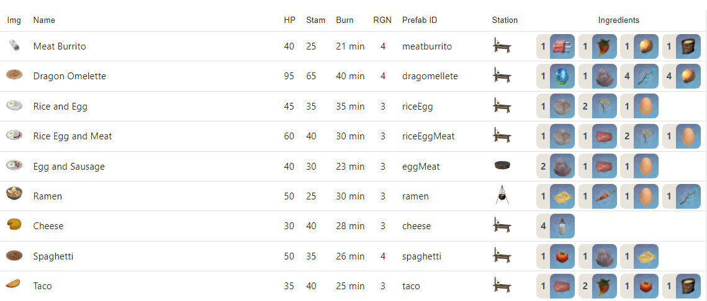

# Valheim Food


Hosted at: https://valharvest.frenvius.com/

## Features

- See stats for food in valheim as well as ingredients with sorting.



## Dependencies && Installation

Requires [Node.js](https://nodejs.org/) v14.15.0. Lower versions are likely not going to work.

Install the dependencies and devDependencies (use yarn to use locked package dependencies)

```sh
yarn
```

## Tech

Base

- [React](https://reactjs.org/)
- [NextJS](https://nextjs.org/)
- [Typescript](https://www.typescriptlang.org/)

UI
- [MUI](https://mui.com/)

## Credits
- [MayaSaringan](https://github.com/MayaSaringan/) for the inspiration of the project
- All images and information are pulled from the [Valheim Wiki](https://valheim.fandom.com/wiki/Food)