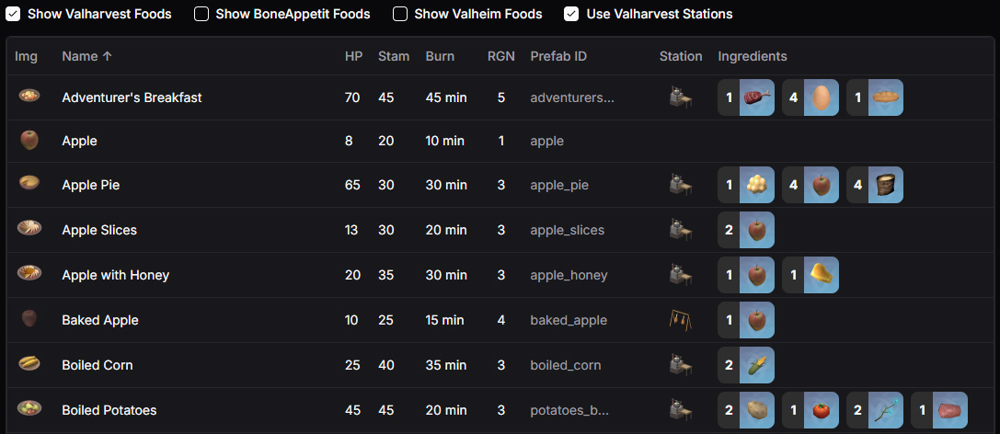

# Valheim Food


Hosted at: https://valharvest.frenvius.com/

## Features

- See stats for food in valheim as well as ingredients with sorting.



## Dependencies && Installation

Install the dependencies using Bun:

```sh
bun install
```

## Tech

Base

- [Next.js 15](https://nextjs.org/) (App Router + Turbopack)
- [React 19](https://reactjs.org/)
- [TypeScript 5](https://www.typescriptlang.org/)

UI

- [Tailwind CSS](https://tailwindcss.com/)

## Credits
- [MayaSaringan](https://github.com/MayaSaringan/) for the inspiration of the project
- All images and information are pulled from the [Valheim Wiki](https://valheim.fandom.com/wiki/Food)
